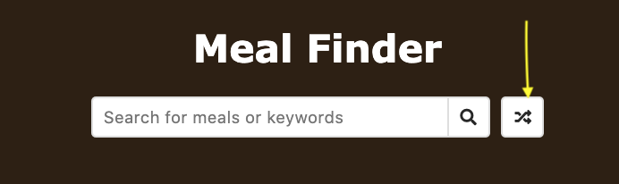

# Meal Finder

This project follows along with the [20 Web Projects With Vanilla JavaScript](https://www.udemy.com/course/web-projects-with-vanilla-javascript/) tutorials by Brad Traversy.

JavaScript, CSS, and HTML are used for this project.

[TheMealDB API](https://themealdb.com/api.php) is accessed for the meal information.

Example when user searches using the term "cheese"

---

From the list of meals, user clicked on "Honey Yogurt Cheesecake"

---

If user would like a random meal, they click on the far right button of the input field

---

Example of meal that appears after random meal button is clicked

---
